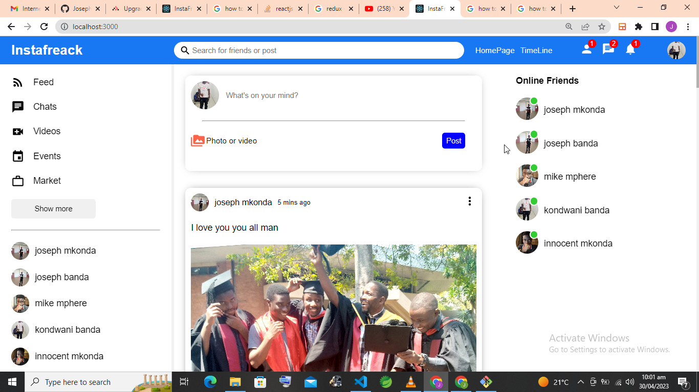

This is social media application.(INSTAFREACK)
The social media system developed in ReactJS, NodeJS, and MongoDB is a powerful platform that provides a user-friendly and dynamic experience for its users. 
The system is designed to enable users to create profiles, share posts, connect with friends, and build a social network. 
It has been developed using the latest technologies, providing a fast and reliable platform for users to connect and interact.

ReactJS is used to develop the frontend of the social media system. 
It is a powerful JavaScript library that allows developers to build reusable user interfaces using modular components. 
The ReactJS framework ensures that the user interface is fast and responsive, providing a seamless user experience. 
Additionally, ReactJS provides a variety of tools and libraries that make it easy to build complex UI components, 
which are an essential part of any social media system.

NodeJS is used to develop the backend of the social media system. 
It is an open-source, cross-platform JavaScript runtime environment that allows developers to build server-side applications.

Finally, MongoDB is used as the database for the social media system. MongoDB is a NoSQL database that provides a flexible and scalable solution for
managing large volumes of data. It is designed to handle unstructured data and provides high availability and automatic scaling.

Overall, the social media system developed in ReactJS, NodeJS, and MongoDB provides a robust and scalable platform that enables users to connect 
and interact in a dynamic and engaging way. It leverages the latest technologies to provide a fast a
nd responsive user experience, making it an ideal choice for building social media systems.

The Home Page

The Profile Page

